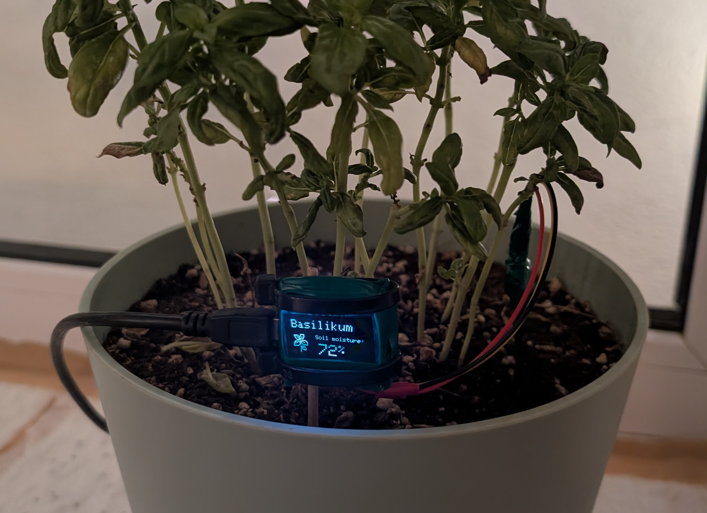
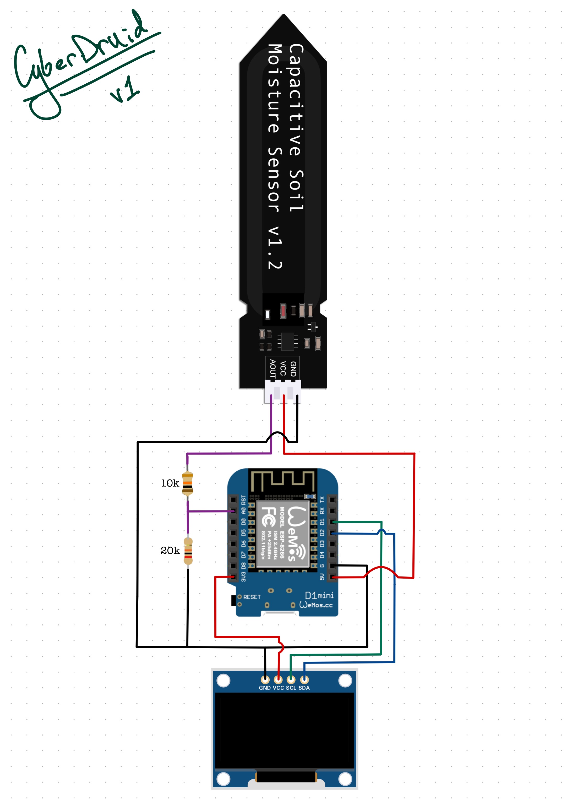

# 🌱 CyberDruid — Smart Soil Moisture Monitoring

<div align="center">
  

*An ESP8266-based soil moisture monitoring system with OLED display and Telegram alerts*
</div>

## 📖 Introduction

CyberDruid is an intelligent soil moisture monitoring system designed to help you effortlessly water your plant on time.
It continuously monitors soil moisture levels using a capacitive sensor, displays real-time data on an OLED screen, and
sends Telegram alerts when the soil moisture level drops below a specified threshold.

### ✨ Features

- **Real-time Monitoring**: Continuous soil moisture percentage tracking
- **Visual Display**: 128x64 OLED screen with beautiful visuals
- **Smart Alerts**: Telegram notifications when moisture level drops below threshold
- **Rolling Average**: Smoothed readings to prevent false alarms
- **Visual Feedback**: Screen inversion when plant needs water
- **WiFi Connectivity**: Remote monitoring and alert system

<div align="center">
  

*This basil was not doing well before CyberDruid was installed!*
</div>

## 🔧 Components Required

| Component                                | Quantity | Description                |
|------------------------------------------|----------|----------------------------|
| **Wemos D1 Mini**                        | 1        | ESP8266 development board  |
| **SSD1306 OLED Display 0,96''**          | 1        | 128x64 I2C OLED screen     |
| **Capacitive Soil Moisture Sensor v1.2** | 1        | Analog moisture sensor     |
| **Resistor 10kΩ & 20kΩ**                 | 1 each   | For voltage divider        |
| **Some Wires**                           | some     | For connections            |
| **Breadboard & Jumper Cables**           | 1 & some | For prototyping (optional) |
| **Micro USB Cable**                      | 1        | For power and programming  |
| **Plant Pot**                            | 1        | Your favorite plant        |

## 🔌 Wiring Diagram

<div align="center">
  

*Wiring diagram for connecting the components*
</div>

### Pin Connections

| Wemos D1 Mini | Component                                                      | Connection    |
|---------------|----------------------------------------------------------------|---------------|
| **D1**        | OLED SCL                                                       | Clock line    |
| **D2**        | OLED SDA                                                       | Data line     |
| **A0**        | Moisture Sensor AOUT                                           | Analog output |
| **3.3V**      | OLED VCC                                                       | Power         |
| **5V**        | Moisture Sensor VCC                                            | Power         |
| **GND**       | OLED GND                                                       | Ground        |
| **GND**       | Moisture Sensor GND <br/>(through voltage divider, see schema) | Ground        |

## 🤖 Telegram Bot Setup

### Step 1: Create a Telegram Bot

1. Open Telegram and search for [`@BotFather`](https://t.me/BotFather)
2. Start a chat and send `/newbot`
3. Follow the prompts to name your bot
4. Save the **Bot Token** provided (format: `123456789:ABCdefGHIjklMNOpqrsTUVwxyz`)

### Step 2: Get Your Chat ID

1. Send a message to your newly created bot
2. Open this URL in your browser (replace `YOUR_BOT_TOKEN`):
   ```
   https://api.telegram.org/botYOUR_BOT_TOKEN/getUpdates
   ```
3. Look for `"chat":{"id":123456789}` in the response
4. Save this **Chat ID** number

## 💻 Local Setup

### Step 1: Install Arduino IDE & Configure ESP8266 Board

1. Download and install Arduino IDE from [arduino.cc](https://www.arduino.cc/en/software)
2. Open Arduino IDE and go to **File** → **Preferences**
3. Add this URL to **Additional Board Manager URLs**:
   ```
   http://arduino.esp8266.com/stable/package_esp8266com_index.json
   ```
4. Go to **Tools** → **Board** → **Boards Manager**
5. Look for "esp8266" and select **LOLIN (WEMOS) D1 R2 & mini**

### Step 2: Install Dependencies

1. Go to **Sketch** → **Include Library** → **Manage Libraries**
2. Install these libraries:
    - **Adafruit SSD1306** by Adafruit
    - **Adafruit GFX Library** by Adafruit
    - **Adafruit BusIO** by Adafruit
    - **LiquidCrystal I2C** by Frank de Brabander

## ⚙️ Code Configuration

### Step 1: Download the Code

Clone or download [this repository](https://github.com/MrGauz/CyberDruid.git) to your computer.

### Step 2: Configure Secrets

Open `cyberdruid/config.hpp` and update the following values:

```cpp
const String WIFI_SSID   = "Your WiFi SSID"; // Your WiFi network name
const char   WIFI_PASS[] = "XXX"; // Your WiFi password  
const String BOT_TOKEN   = "0000000000:AAAAAA...AAAAAA"; // Your Telegram bot token
const String CHAT_ID     = "123456789"; // Your Telegram ID
```

### Step 3: Calibrate Sensor Values

You may need to adjust these values based on your specific sensor:

```cpp
// Sensor Calibration
const int SENSOR_DRY_VALUE = 395;  // Value when sensor is dry (in air)
const int SENSOR_WET_VALUE = 260;  // Value when sensor is wet (in water)
```

**To calibrate:**

1. Hold the sensor up in the air → note the reading
2. Place sensor in a glass of water → note the reading
3. Update `SENSOR_DRY_VALUE` and `SENSOR_WET_VALUE` accordingly

### Step 4: Customize Plant Settings

```cpp
// Plant Configuration
const String PLANT_NAME = "Basilikum";           // Your plant's name
const uint8_t MOISTURE_THRESHOLD = 50;           // Alert threshold (0-100%)
const unsigned long ALERT_COOLDOWN = (6UL * 60 * 60 * 1000); // 6 hours between alerts
```

If you want to change the plant icon, you can create a new bitmap using an online tool like
[dot2pic.com](https://dot2pic.com/) and update `bitmaps.hpp` (please submit a PR if you add more icons).

Optimal image size is 40x40 pixels, update `IMAGE_HEIGHT` & `IMAGE_WIDTH` constants if you change dimensions.
Bitmap should be monochromatic with 8 pixels per byte in horizontal order.

## 🚀 Upload and Run

### Step 1: Connect Hardware

1. Connect all components according to the wiring diagram
2. Connect Wemos D1 Mini to your computer via USB

### Step 2: Upload Code

1. Open `cyberdruid/cyberdruid.ino` in Arduino IDE
2. Select the correct COM port: **Tools** → **Port** → **COM[X]**
3. Click the **Upload** button (→)
4. Wait for "Done uploading" message

### Step 3: Monitor Serial Output

1. Open **Tools** → **Serial Monitor**
2. Set baud rate to **115200**

## 🔧 Troubleshooting Common Issues

**OLED Display Not Working:**

- Check I2C connections (see wiring diagram)
- Verify display address (default: 0x3C)
- Use `find_display_addr.ino` to scan for I2C devices

**WiFi Connection Failed:**

- Verify SSID and password in `config.hpp`
- Check WiFi signal strength
- Ensure 2.4GHz network (ESP8266 doesn't support 5GHz)

**Telegram Alerts Not Sending:**

- Verify bot token and chat ID
- Check internet connection
- Monitor serial output for error messages

**Inaccurate Moisture Readings:**

- Calibrate sensor values for your specific soil type
- Check the wiring (must be powered with 5V)
- Ensure sensor address is correct in `config.hpp`

## 🤝 Contributing

Contributions are welcome! Please feel free to submit [a Pull Request](https://github.com/MrGauz/CyberDruid/pulls) with any improvements, bug fixes, or new plant icons.

📦 Designing a 3D printable case for sensor protection and aesthetics would be much appreciated!

## 📄 License

This project is licensed under the MIT License — you can freely use, modify, and distribute it.

---

**Happy Home Gardening! 🌱**
